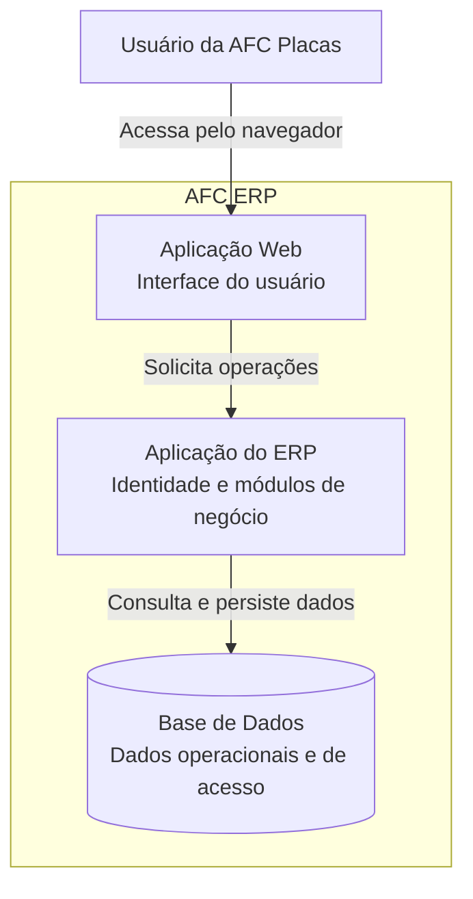

# Arquitetura Global — AFC ERP

Este documento apresenta a arquitetura do AFC ERP em alto nível, cobrindo o contexto do sistema e seus principais blocos. O detalhamento interno de cada módulo pertence às suas respectivas [especificações](../specs/).

## 1. Contexto do sistema

O AFC ERP é um sistema interno de gestão que centraliza os processos administrativos da AFC Placas. Ele oferece aos usuários autorizados um único ponto de acesso às funcionalidades do negócio e aplica uma política comum de identidade e controle de acesso.

### Fronteira atual

O AFC ERP é responsável por:

- disponibilizar as funcionalidades administrativas da empresa;
- centralizar a identidade dos usuários e o controle de acesso;
- organizar as capacidades do produto em módulos de negócio;
- manter os dados necessários para executar esses processos.

Integrações com sistemas externos ainda não fazem parte da arquitetura definida. Elas devem ser incluídas neste contexto quando surgirem necessidades concretas.

## 2. Visão dos principais blocos

O sistema é organizado como uma aplicação web composta por uma interface para os usuários, uma aplicação responsável pelas regras e módulos do ERP e uma base de dados persistente.

### Aplicação Web

É o ponto de interação dos usuários com o ERP. Apresenta as funcionalidades disponíveis e conduz os fluxos dos diferentes módulos, respeitando o acesso concedido a cada usuário.

### Aplicação do ERP

Concentra as capacidades do sistema e coordena o acesso aos dados. Sua organização é modular: o módulo Identity fornece a base comum de identidade e autorização, enquanto os módulos de negócio incorporam progressivamente os processos administrativos previstos para o produto.

Essa separação é lógica. Não implica que cada módulo seja uma aplicação ou serviço independente.

### Base de Dados

Mantém os dados operacionais dos módulos e os dados necessários ao controle de acesso. Cada módulo deve preservar a responsabilidade sobre seu próprio domínio, mesmo quando os dados compartilham a mesma infraestrutura de persistência.

## 3. Organização modular

O ERP evolui por módulos com responsabilidades próprias, integrados dentro da mesma experiência para o usuário. O Identity é uma capacidade transversal: identifica o usuário e determina quais ações estão disponíveis nos demais módulos, sem incorporar as regras de negócio deles.

Novos módulos são adicionados conforme a [roadmap do produto](../product/ROADMAP.md). Seus limites, fluxos e regras são definidos nas respectivas especificações, sem ampliar este documento com detalhes internos.

## 4. Princípios arquiteturais

- **Sistema único e modular:** os módulos formam um ERP integrado, mantendo responsabilidades bem delimitadas.
- **Identidade centralizada:** autenticação e autorização seguem uma base comum para todo o sistema.
- **Evolução incremental:** a arquitetura cresce junto com as necessidades confirmadas do produto.
- **Baixo acoplamento entre domínios:** mudanças em um módulo devem causar o menor impacto possível nos demais.
- **Simplicidade operacional:** novas divisões de infraestrutura só devem ser introduzidas quando trouxerem benefício concreto.

## 5. Limites deste documento

Esta visão corresponde aos níveis de contexto e contêineres do modelo C4. Tecnologias, componentes internos, modelos de dados, endpoints, fluxos e regras de negócio são decisões de nível mais detalhado e permanecem nas especificações dos módulos.

[Voltar para o início](../README.md)
