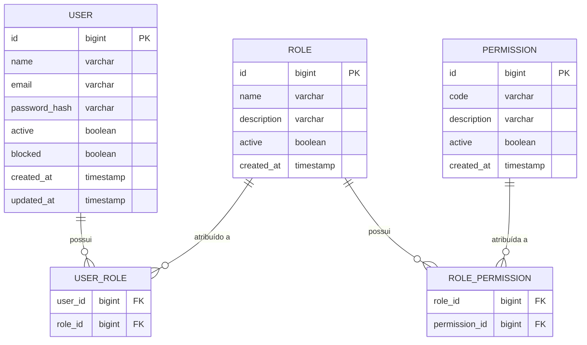

# 📘 Módulo de Autenticação e Controle de Acessos (RBAC)

## 1. Visão Geral

O módulo de Autenticação e Controle de Acessos (RBAC) é uma parte fundamental da infraestrutura do ERP AFC, responsável por proteger recursos internos e garantir que cada usuário tenha acesso apenas ao que lhe é permitido.
Ele atua como a camada de segurança do sistema, servindo de base para os demais módulos do ERP.
Seu design permite evoluir o ERP por etapas, mantendo o controle de acesso centralizado e padronizado.

A solução foi projetada para ser **simples, escalável, modular e reutilizável** em outros sistemas da empresa.

---

## 2. Objetivos do Módulo

- **Autenticação segura** de usuários por meio de token JWT.  
- **Autorização baseada em permissões (RBAC)**, permitindo granularidade fina no controle de acesso.  
- **Gestão administrativa** completa de usuários, roles e permissões.  
- **Padronização do modelo de segurança** para todos os módulos do ERP AFC.  
- **Baixo acoplamento**, permitindo evolução incremental do sisteam como um todo.

---

## 3. Componentes Principais da Arquitetura

A solução é composta por três áreas principais:

### 3.1. Frontend (Angular)

- Aplicação SPA responsável pela interface do usuário.
- Módulos independentes para:
  - Login
  - Dashboard
  - Administração (usuários, roles, permissões)
- Guards controlam o acesso conforme permissões do usuário autenticado.

### 3.2. Backend (Spring Boot)

- API REST responsável pela lógica de autenticação, autorização e gestão administrativa.
- Estruturado de forma modular por domínio:
  - `auth`
  - `user`
  - `role`
  - `permission`
- Implementa:
  - Login
  - Refresh de tokens
  - Validação de permissões
  - CRUDs administrativos

### 3.3. Banco de Dados Relacional

- Estrutura simples e padronizada:
  - `users`
  - `roles`
  - `permissions`
  - `user_roles`
  - `role_permissions`
- Relações muitos-para-muitos garantem flexibilidade na composição de perfis.

### 3.4. Diagrama ER — Modelo de Dados

---

## 4. Modelo de Segurança

O modelo de segurança segue uma abordagem **RBAC baseada em permissões**, garantindo amplo controle e flexibilidade.

### 4.1. Autenticação

- Utiliza JWT com **access token** e **refresh token**.
- O backend valida credenciais e distribui tokens de forma segura.
- O frontend mantém somente tokens, sem armazenar senhas.

### 4.2. Autorização

- Cada rota/funcionalidade é protegida por **permissions** (ex.: `USER_MANAGE`, `ROLE_MANAGE`).
- Roles agrupam permissions e podem ser alteradas via interface administrativa.
- Usuários recebem roles, e suas permissions são calculadas dinamicamente.

### 4.3. Benefícios

- Granularidade fina no controle de acesso.  
- Flexibilidade para criar novos perfis sem alterar o código.  
- Segurança consistente entre frontend e backend.  

---

## 5. Organização Modular

A arquitetura modular foi escolhida para:

- Facilitar manutenção.
- Permitir evolução por partes independentes.
- Evitar acoplamento entre domínios.
- Reutilizar o módulo de segurança em outros projetos.

### 5.1. Módulos do Backend

| Módulo         | Responsabilidade                                        |
|----------------|----------------------------------------------------------|
| **auth**       | Autenticação, JWT, refresh token, segurança             |
| **user**       | Gestão de usuários                                      |
| **role**       | Gestão de roles                                         |
| **permission** | Lista de permissões e vínculo com roles                 |
| **shared**     | Utilidades e componentes comuns                         |

### 5.2. Módulos do Frontend

| Módulo         | Responsabilidade                                        |
|----------------|----------------------------------------------------------|
| **auth**       | Tela e lógica de login                                  |
| **dashboard**  | Tela inicial do usuário autenticado                     |
| **admin**      | Gerenciamento de usuários, roles e permissões           |
| **core**       | Guards, serviços e interceptores                        |
| **shared**     | Componentes reutilizáveis                               |

---

## 6. Benefícios da Arquitetura

- **Simplicidade operacional**  
- **Manutenção facilitada**  
- **Evolução modular**  
- **Segurança robusta e padronizada**  
- **Baixo acoplamento**  
- **Reutilização do módulo RBAC em outras aplicações**  
- **Facilidade de auditoria e governança de acessos**

---

## 7. Conclusão

A arquitetura proposta entrega:

- Um núcleo de segurança forte  
- Um modelo RBAC flexível e expansível  
- Um frontend modular e organizado  
- Um backend claro, seguro e fácil de manter  

Tudo isso mantendo simplicidade e baixo custo de operação, permitindo que o foco do projeto esteja na evolução do produto e não na complexidade da infraestrutura.
