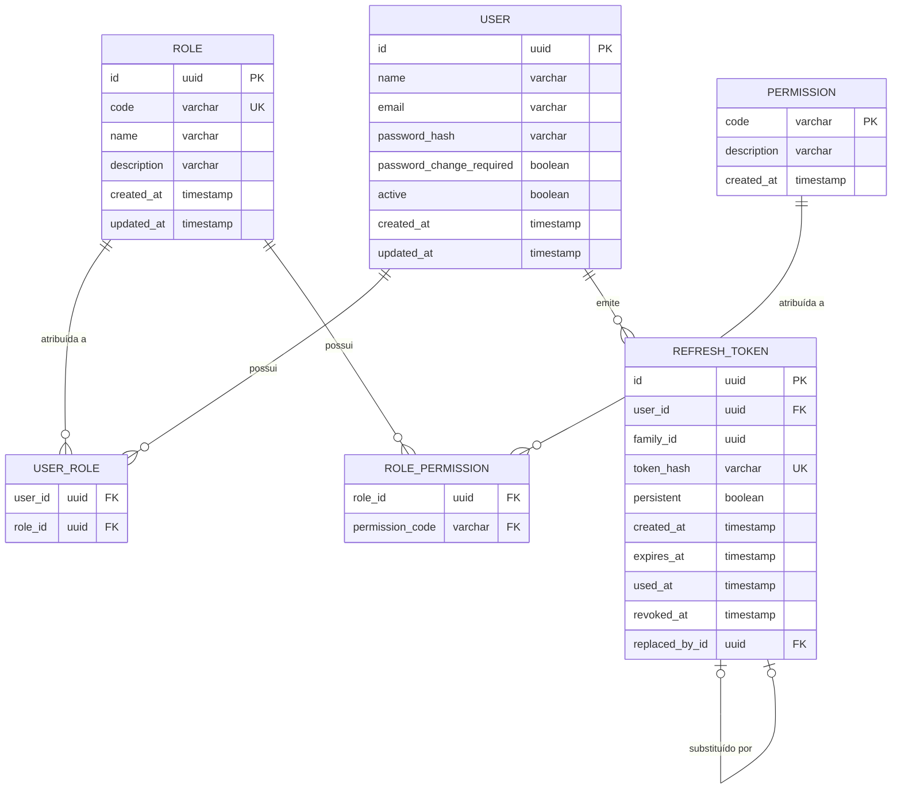

# Módulo Identity — Arquitetura

## 1. Propósito e limites deste documento

Este documento descreve a solução técnica do módulo Identity: fronteiras, componentes,
modelo de dados, estratégias de autenticação e autorização, organização modular e trade-offs.

Fontes relacionadas:

- [Escopo](./scope.md) — capacidades, regras de negócio e limites do módulo
- [Fluxos](./flows.md) — sequência dos comportamentos esperados
- [Arquitetura global](../../architecture/architecture.md) — contexto de nível superior do ERP

Decisões internas deste documento não ampliam o escopo do produto. Quando uma regra funcional for
citada, o objetivo é explicar o impacto técnico correspondente, sem redefinir o comportamento.

---

## 2. Visão técnica do módulo

O Identity é a base transversal de autenticação e controle de acesso do AFC ERP. Tecnicamente, ele
concentra:

- emissão e validação de sessão autenticada;
- resolução e transporte de autorizações;
- persistência do domínio de usuários, roles, permissions e refresh tokens;
- contratos HTTP e configuração de segurança compartilhados pelos demais módulos.

A modularização é lógica dentro da aplicação monolítica do ERP. Frontend, backend e banco
permanecem contêineres distintos, mas o Identity não é um microsserviço separado.

---

## 3. Componentes e responsabilidades

### 3.1 Frontend (Angular)

- Materializa a experiência de autenticação e as telas administrativas do módulo.
- Mantém o access token somente em memória; não lê nem manipula o refresh token.
- Usa guards, interceptors e menus para orientar a navegação e a apresentação com base nas
  permissions conhecidas na sessão.
- Nunca é a autoridade final de autorização: o backend decide cada operação protegida.

### 3.2 Backend (Spring Boot)

- Autentica credenciais, emite e valida tokens e aplica CSRF nas operações baseadas em cookie.
- Resolve permissions e o indicador Root no signin e no refresh.
- Executa a autorização efetiva e as regras de domínio do Identity.
- Persiste usuários, roles, permissions, vínculos e o estado dos refresh tokens.

### 3.3 Persistência (PostgreSQL)

- Mantém o modelo relacional necessário à autenticação e ao RBAC.
- Armazena apenas o hash do refresh token, nunca o valor em claro.
- Suporta rotação por família, revogação e limpeza periódica dos registros de sessão.

---

## 4. Modelo de dados

O diagrama abaixo inclui o núcleo RBAC e a tabela de refresh tokens, necessária para explicar
rotação, família e revogação.

Decisões do modelo:

- um usuário pode possuir várias roles;
- role usa UUID como identidade e possui código administrativo único e editável;
- permission usa `code` como identidade técnica imutável;
- usuários recebem permissions exclusivamente através de roles;
- a Role Root não precisa receber vínculos em `role_permissions`;
- `refresh_tokens` referencia o usuário e permite rastrear família, uso, revogação e substituição.

---

## 5. Arquitetura de segurança

### 5.1 Autenticação e sessão

Decisões técnicas:

- access token JWT assinado e de curta duração;
- access token mantido apenas em memória no frontend;
- refresh token opaco, rotativo e de uso único;
- refresh token enviado em cookie `HttpOnly` e persistido somente como hash;
- proteção CSRF nas operações que usam o cookie de refresh;
- rotação por família, com revogação da família diante de reutilização;
- sessão HTTP stateless no Resource Server.

A duração do access token é configurável; o valor atual de referência é `15m`.

### 5.2 Autorização

- A autorização efetiva ocorre no backend, por permission.
- Permissions efetivas e o indicador Root são resolvidos no signin e em cada refresh.
- Esses dados trafegam como claims assinadas do access token.
- O frontend usa permissions apenas para navegação e apresentação.
- O bypass Root é centralizado e não preenche artificialmente todas as permissions no token.
- Em requisições autenticadas normais, o backend valida a assinatura e as claims do JWT sem
  consultar o usuário no banco a cada chamada.

O catálogo de permissions é técnico e imutável pela interface administrativa. A administração
consulta o catálogo e gerencia seus vínculos com roles; permissions não são criadas, editadas ou
excluídas pela interface.

### 5.3 Consistência e validade das autorizações

Permissions e o indicador Root representam um snapshot assinado no momento da emissão do access
token. Alterações de roles, permissions ou estado do usuário passam a valer em novos signins e
refreshes. Um access token já emitido permanece utilizável até expirar.

Essa janela é o trade-off do modelo JWT stateless: o backend evita consulta ao banco por
requisição autenticada, ao custo de aceitar o snapshot até a expiração do access token. Se o
produto exigir revogação imediata no futuro, o modelo deverá ser revisto.

### 5.4 Sessão restrita para troca obrigatória

Impactos técnicos da sessão restrita por troca obrigatória de senha:

- a sessão restrita não recebe permissions nem bypass Root;
- o estado de troca obrigatória precisa ser preservado ou recalculado no refresh, para que a
  sessão restrita não ganhe acesso normal apenas pela renovação;
- a redefinição administrativa revoga as famílias de refresh existentes do usuário;
- usuário inativo não inicia nem renova sessão;
- operações sobre o próprio perfil derivam a identidade do principal autenticado, não de um ID
  escolhido pelo cliente.

---

## 6. Organização modular

A organização abaixo representa a estrutura arquitetural definida para o módulo. Ela é lógica e não implica microsserviços.

### 6.1 Backend

Pacotes relevantes sob `com.lucas.freitas.tech.afc.erp.backend`:

| Pacote | Responsabilidade |
|--------|------------------|
| `identity.authentication` | Signin, logout, emissão de sessão e contratos HTTP `/auth` |
| `identity.authentication.refresh` | Geração, rotação, cookie, persistência e limpeza de refresh tokens |
| `identity.authorization` | Roles, permissions, resolução de autorizações e helpers de autorização |
| `identity.user` | Modelo, persistência e integração do usuário com a segurança |
| `security` | JWT, CORS, Resource Server e configuração transversal do Spring Security |
| `shared` | Tratamento de erros e componentes comuns |

### 6.2 Frontend

Organização vigente em `src/app`:

| Área | Responsabilidade |
|------|------------------|
| `core/auth` | Sessão em memória, serviços de autenticação, guards e interceptors |
| `features/auth` | Tela e fluxo de login |
| `features/home` | Home da área autenticada |
| `layout` | Estrutura visual da área autenticada |

Features administrativas de usuários e roles devem nascer como features de domínio próprias
quando forem implementadas, sem antecipar pastas vazias. A sessão e os mecanismos transversais
permanecem em `core/auth`.

---

## 7. Decisões e trade-offs

| Decisão | Consequência |
|---------|--------------|
| JWT stateless para autorização na requisição | Evita consulta ao banco por chamada autenticada; alterações de acesso só atingem um access token já emitido após sua expiração |
| Refresh rotativo persistido em PostgreSQL | Evita Redis na infraestrutura atual; exige limpeza periódica dos registros de refresh |
| Access token só em memória no frontend | Evita a persistência do access token no navegador e limita sua exposição após o encerramento da aplicação; não elimina riscos durante um XSS ativo. A restauração de sessão depende do refresh cookie |
| Frontend usa permissions apenas para UX | Melhora navegação e menus, mas não substitui a autorização do backend |
| Modularização lógica por pacote/feature | Mantém fronteiras claras sem transformar o ERP em microsserviços |
| Catálogo de permissions imutável pela UI | Evita divergência entre código e banco; novas permissions entram por evolução controlada do sistema |

---

[◀ Voltar para os fluxos](./flows.md) | [⯅ Ir para a especificação](./README.md) | [Ir para os épicos ▶](./epics.md)
