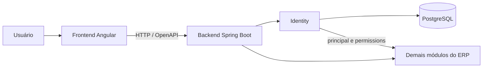
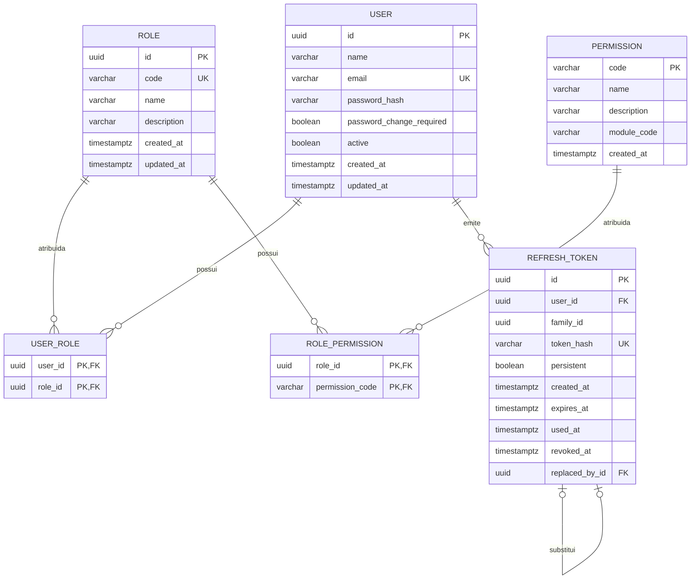

# Arquitetura do módulo Identity

## Propósito e limites

Este documento descreve a arquitetura-alvo do módulo Identity: fronteiras, responsabilidades,
modelo de dados, segurança, consistência e decisões técnicas. Ele sustenta os comportamentos
definidos no [escopo](./scope.md) e nos [fluxos](./flows.md), sem criar requisitos de produto.

O Identity é um módulo lógico do monólito do AFC ERP. Ele não constitui um microsserviço e não é
responsável pelas regras de negócio dos demais módulos.

## Contexto e fronteiras

O módulo fornece identidade autenticada e autorização para o restante do ERP.

```mermaid
flowchart LR
    U[Usuário] --> F[Frontend Angular]
    F -->|HTTP / OpenAPI| B[Backend Spring Boot]
    B --> I[Identity]
    I --> P[(PostgreSQL)]
    B --> M[Demais módulos do ERP]
    I -->|principal e permissions| M
```

- o frontend conduz autenticação, perfil e administração, mas não decide autorizações;
- o backend é a autoridade para autenticação, autorização e regras do domínio;
- o PostgreSQL mantém usuários, roles, permissions, vínculos e refresh tokens;
- os demais módulos consomem o principal autenticado e exigem permissions definidas pelo sistema;
- OpenAPI é a fonte canônica dos contratos HTTP detalhados.

Requisitos sustentados: RN002, RN003, RN005, RF004, RNF003.

## Componentes e responsabilidades

### Frontend Angular

- apresentar login, troca obrigatória de senha, perfil e telas administrativas;
- manter o access token somente em memória;
- restaurar a sessão por meio do cookie de refresh, sem acessar seu conteúdo;
- usar guards, interceptors e permissions para navegação e apresentação;
- limpar o estado local ao encerrar ou perder a sessão.

### Backend Spring Boot

- autenticar credenciais e emitir, renovar e revogar sessões;
- recalcular estado, permissions efetivas e bypass Root no signin e no refresh;
- aplicar permissions e regras de domínio em toda operação protegida;
- manter usuários, roles, permissions e seus vínculos;
- aplicar validação, transações, proteção CSRF e tratamento seguro de falhas.

### PostgreSQL

- garantir unicidade, integridade referencial e vínculos muitos-para-muitos;
- persistir somente hashes de senhas e refresh tokens;
- sustentar rotação, revogação e limpeza de famílias de refresh token.

## Modelo de dados

```mermaid
erDiagram
    USER {
        uuid id PK
        varchar name
        varchar email UK
        varchar password_hash
        boolean password_change_required
        boolean active
        timestamptz created_at
        timestamptz updated_at
    }

    ROLE {
        uuid id PK
        varchar code UK
        varchar name
        varchar description
        timestamptz created_at
        timestamptz updated_at
    }

    PERMISSION {
        varchar code PK
        varchar name
        varchar description
        varchar module_code
        timestamptz created_at
    }

    USER_ROLE {
        uuid user_id PK, FK
        uuid role_id PK, FK
    }

    ROLE_PERMISSION {
        uuid role_id PK, FK
        varchar permission_code PK, FK
    }

    REFRESH_TOKEN {
        uuid id PK
        uuid user_id FK
        uuid family_id
        varchar token_hash UK
        boolean persistent
        timestamptz created_at
        timestamptz expires_at
        timestamptz used_at
        timestamptz revoked_at
        uuid replaced_by_id FK
    }

    USER ||--o{ USER_ROLE : possui
    ROLE ||--o{ USER_ROLE : atribuida
    ROLE ||--o{ ROLE_PERMISSION : possui
    PERMISSION ||--o{ ROLE_PERMISSION : atribuida
    USER ||--o{ REFRESH_TOKEN : emite
    REFRESH_TOKEN |o--o| REFRESH_TOKEN : substitui
```

Restrições estruturais:

- `users.email` é único sem distinção entre maiúsculas e minúsculas;
- `roles.code` é único, administrativo e editável;
- `permissions.code` é a identidade técnica imutável;
- `permissions.module_code` é obrigatório e usa a convenção `A-Z0-9_`;
- permissions chegam aos usuários apenas por `user_roles` e `role_permissions`;
- a Role Root não depende de registros em `role_permissions` para conceder acesso total;
- o refresh token em claro nunca é persistido.

Requisitos sustentados: RN001, RN003, RN004, RN005, RN006, RN009, RNF001, RNF002.

## Contratos e integrações

Os contratos HTTP são agrupados por responsabilidade:

| Grupo | Responsabilidade |
|---|---|
| `/auth` | signin, refresh, logout e troca obrigatória de senha |
| perfil autenticado | consulta, atualização e troca da própria senha |
| usuários | consulta e administração de usuários e seus vínculos com roles |
| roles | consulta e administração de roles e seus vínculos com permissions |
| permissions | consulta paginada do catálogo técnico imutável |

Contratos de consulta compartilhados:

| Rota lógica | Autorização no backend | Consumidores |
|---|---|---|
| listagem de permissions | `PERMISSION_READ` OR `ROLE_READ` OR Root | catálogo administrativo e formulário de role |
| listagem de roles | `ROLE_READ` OR `USER_READ` OR Root | administração de roles e formulário de usuário |

Regras de integração:

- payloads, códigos HTTP e schemas detalhados pertencem ao OpenAPI;
- cada caso acima usa a mesma rota de listagem, e basta uma das autorizações indicadas;
- `ROLE_READ` não libera a página administrativa de permissions;
- `USER_READ` não libera a página administrativa de roles;
- DTOs de saída nunca expõem senha, hash ou refresh token.

Requisitos sustentados: RF006 a RF024, RNF001.

## Segurança

### Autenticação e sessão

- access token JWT assinado, de curta duração e mantido apenas em memória no frontend;
- refresh token opaco, rotativo, de uso único e entregue em cookie `HttpOnly`, `Secure` e com
  política `SameSite` compatível com a implantação;
- somente o hash do refresh token é armazenado;
- operações baseadas no cookie de refresh são protegidas contra CSRF;
- reutilização de refresh token revoga sua família;
- senhas são processadas por função de derivação adaptativa, com salt individual e fator de custo;
- o formato persistido identifica algoritmo e parâmetros para permitir evolução controlada;
- falhas de autenticação e renovação retornam mensagens que não revelam a causa sensível.

### Autorização

- o backend autoriza por permission efetiva, nunca diretamente por role;
- permissions efetivas são a união das permissions das roles do usuário;
- permissions, estado de troca obrigatória e bypass Root são recalculados no signin e no refresh;
- o bypass Root é centralizado e não exige inserir todas as permissions no token;
- guards e visibilidade de elementos no frontend servem somente à experiência do usuário;
- o catálogo de permissions é alterado apenas pela evolução controlada do sistema.

### Sessão restrita

- uma sessão com troca de senha obrigatória não recebe permissions nem bypass Root;
- ela permite somente troca de senha, refresh compatível com a restrição e logout;
- a conclusão da troca revoga a sessão restrita e exige nova autenticação;
- a identidade das operações de perfil vem do principal autenticado, não de um ID enviado pelo
  cliente.

Requisitos sustentados: RN002 a RN007, RN010, RN012, RN013, RF001 a RF005, RNF001 a RNF006.

## Consistência e transações

- criação e atualização de role validam as dependências entre permissions e persistem a role e o
  conjunto completo somente quando a combinação atende à RN014, em uma única transação;
- exclusão de role verifica vínculos com usuários ativos e remove os vínculos permitidos na mesma
  transação;
- criação e atualização de usuário persistem usuário e roles como uma unidade;
- bloqueio, exclusão, troca de senha e redefinição administrativa revogam as famílias de refresh
  relacionadas na mesma unidade transacional da mudança principal;
- a rotação marca o token anterior como usado, cria seu substituto e liga ambos atomicamente;
- concorrência ou reutilização na rotação resulta em rejeição e revogação da família;
- um access token já emitido representa um snapshot assinado e permanece válido até expirar.

Esse último comportamento é uma consistência temporal deliberada: alterações de acesso tornam-se
efetivas no próximo signin ou refresh e, para tokens existentes, no máximo ao fim da duração do
access token.

Requisitos sustentados: RN008 a RN012, RN014, RF002, RF008, RF013 a RF024, RNF006.

## Organização modular

### Backend

| Área lógica | Responsabilidade |
|---|---|
| `identity.authentication` | signin, logout, sessão restrita e contratos de autenticação |
| `identity.authentication.refresh` | geração, rotação, cookie, persistência e limpeza de refresh tokens |
| `identity.authorization.permission` | catálogo e resolução de permissions |
| `identity.authorization.role` | roles e vínculos com permissions |
| `identity.user` | usuários, perfil, credenciais e vínculos com roles |
| `security` | JWT, CORS, CSRF, Resource Server e configuração transversal |
| `shared` | erros e componentes reutilizáveis sem regra específica do Identity |

### Frontend

| Área lógica | Responsabilidade |
|---|---|
| `core/auth` | estado da sessão, serviços, guards e interceptors |
| `core/navigation` | navegação e rótulos derivados das permissions |
| `features/auth` | login e troca obrigatória de senha |
| `features/profile` | consulta, edição e troca da própria senha |
| `features/admin/users` | administração de usuários |
| `features/admin/roles` | administração de roles |
| `features/admin/permissions` | consulta administrativa do catálogo |
| `layout` | estrutura visual da área autenticada |

Essas fronteiras expressam responsabilidades arquiteturais. Elas orientam a implementação sem
exigir pastas vazias nem transformar o módulo em serviços independentes.

## Decisões arquiteturais

### AD001 — Identity como módulo do monólito

O Identity permanece uma fronteira lógica no backend e no frontend. A decisão reduz complexidade
operacional sem abrir mão de responsabilidades explícitas.

### AD002 — JWT stateless para access token

O backend não consulta o banco a cada requisição autenticada. Em contrapartida, mudanças de acesso
atingem tokens emitidos somente após refresh ou expiração.

### AD003 — Refresh token rotativo no PostgreSQL

A persistência relacional evita introduzir outra infraestrutura e permite rotação e revogação por
família. Ela exige índices e limpeza periódica dos registros expirados.

### AD004 — Access token somente em memória

O frontend não persiste o access token no armazenamento do navegador. A restauração de sessão
depende do cookie de refresh e a medida não elimina riscos durante um XSS ativo.

### AD005 — Permissions como autoridade de acesso

Roles agrupam permissions, mas não são usadas diretamente para autorizar funcionalidades. Isso
desacopla o acesso dos perfis administrativos.

### AD006 — Catálogo de permissions controlado pelo sistema

Permissions não são alteradas pela interface. Novas capacidades entram por evolução versionada do
sistema, preservando a correspondência entre código e banco.

### AD007 — Hash de senha adaptativo e evolutivo

O mecanismo de hash deve usar função de derivação adaptativa, salt individual e fator de custo
configurável. O valor persistido deve identificar o algoritmo e seus parâmetros, permitindo elevar
o custo ou migrar o algoritmo sem armazenar senhas em claro. A biblioteca ou encoder concreto é uma
decisão de implementação subordinada a essas propriedades.

---

[Voltar para os fluxos](./flows.md) | [Ir para a especificação](./README.md) | [Ir para os épicos](./epics.md)
